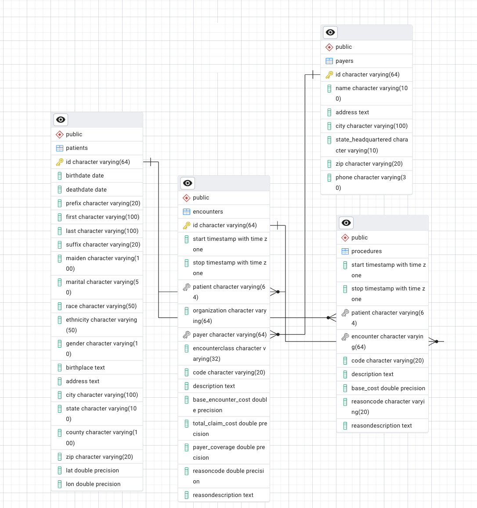
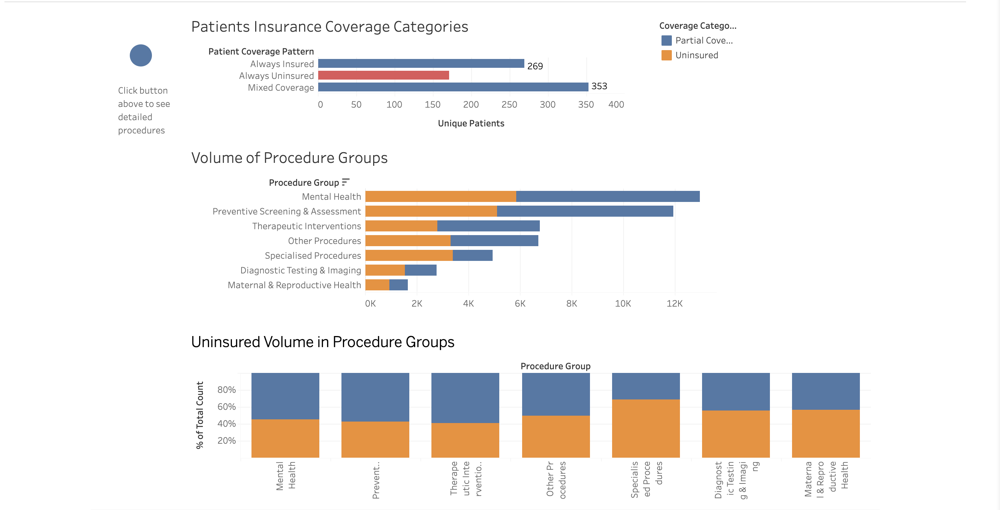
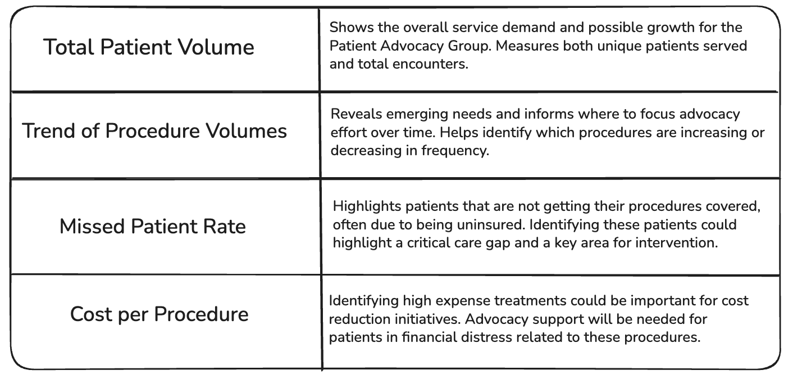

# MyTomorrows Technical Test

- HASAN JOHN KIDEYS, completed on 25/06/2025
- Link to Github repo with Task 1 solution: 

## Task 1: United Healthcare Analysis

### Business Impact Summary
This analysis provides United Healthcare with actionable insights into high volume procedures and insurance coverage gaps of patients, enabling targeted interventions to reduce the uninsured patient populations.

### Key Findings
Identifying high volume procedures: Mental Health procedures represent the largest volume with significant uninsured patients, creating opportunities for interventions.

Specialised procedures show the highest percentage of uninsured patients.

Prioritising preventive screening and mental health procedures for coverage expansion initiatives will create the highest impact on patient outcomes.

There are currently 171 patients who are not insured and 353 patients who were insured for some encounters and uninsured during other encounters. These cohorts have been categorised as "Always uninsured" and "Mixed coverage" respectively. 

### Technical Implementation

#### Data Infrastructure Setup
The provided CSV files were ingested into a local PostgreSQL database with properly defined table relationships reflecting the healthcare data model. A dbt project was configured to connect to this local PostgreSQL database, allowing the creation of analysis ready tables for Tableau.

For the production environment, migrating the PostgreSQL database to a cloud service such as Google Cloud SQL could be explored.

Relationships were created for the tables to create the data model. For example, the "id" column in the encounters table has a one to many relationship with the "encounter" column in the procedures table.

#### Data Transformation Logic

- A comprehensive dbt model was developed to standardise insurance coverage categories of patients (Uninsured, Partial Coverage, Full Coverage). The assumption is made that if the PAYER_COVERAGE column is 0 then the given encounter is "uninsured". If all the encounters of a patient have 0 for the PAYER_COVERAGE column then the patient is categorised as "Always uninsured". Which is an important criteria to detect missed patients. If all the encounters of a patient have a higher value than 0 for the PAYER_COVERAGE column, the patient is classified as "Always insured". The rest of the patients are classified as "Mixed Coverage". This group of patients are showing insurance gaps and are also important to monitor to ensure continuous coverage.

- The procedures dataset shows 163 unique procedure descriptions. The similar procedures have been grouped by using certain keywords/patterns among the SNOMED CT codes.Some of these groups have been named as Mental Health, Preventive Screening, Diagnostic Testing, etc. The grouping of procedure codes is important to create meaningful insights from the data.

- The granular procedure level data is kept while also providing standardised groupings for analysis.

- Implement HIPAA compliant data suppression for procedures with fewer than 10 occurrences. This is important for patient confidentiality and to ensure information is unidentifiable.

#### Dashboard Design
The primary dashboard provides United Healthcare stakeholders with a high level view of procedure groups sorted by volume, with colour coded visualisation highlighting insurance coverage categories. Uninsured patients are displayed in red to draw immediate attention gaps requiring intervention.

HIPAA Compliance Implementation
The visualisation incorporates healthcare data privacy best practices by suppressing procedure counts below 10 occurrences, ensuring patient privacy while maintaining analytical value through intelligent grouping strategies.

The dashboard displays 4 charts. 
Patients Insurance Coverage Categories: This chart shows missed patients as well as uninsured and insured and mixed coverage(sometimes insured sometimes not)
Volume of Procedure Groups: 
Uninsured Volume in Procedure Groups:
Procedure Volumes (≥10 Records): 

To view the dashboard please click the following link:
[View the dashboard](https://public.tableau.com/shared/SRPTRMGXW?:display_count=n&:origin=viz_share_link)

#### Limitations

Due to Tableau Desktop license constraints, Tableau Public was utilised for visualisation. Since Tableau Public cannot connect directly to PostgreSQL, the dbt transformed tables were exported as CSV files and connected as text file data sources. All dashboards are public and this has been used to demonstrate the visualisations. In production, Tableau Public should never be used, especially with sensitive healthcare datasets. 

The current model flags an encounter as *Uninsured* only when "PAYER_COVERAGE" is equal to 0. However during final data quality chekcs, a **"NO_INSURANCE" (8807 records)** value was discovered in the payers dataset. Because this value was not included in the original dbt model, the uninsured figures in the dashboard figures will likely be misleading. With more time and capacity the dbt model logic can be updated to reflect this change.

#### Steps to Improve the Solution

More time is needed to improve the keyword based grouping of the procedure description codes. Using snomed hierarchies could improve the grouping of procedure codes. Another method for grouping could be to use an LLM to group the codes under similar groups.

## Task 2: Internal Report for Multi-Specialty Hospital Team (Humana)

Each clinical team  at Humana may want to focus on the procedures that they are responsible for and to track how many patients they have engaged with. Cardiology team may want to filter to see cardiovascular procedures, Mental Health Practitioners/Specialists may want to see mental health related procedures. This would allow clinicians to see the data they are clinically familiar with and that is relevant to them.

In Tableau Desktop it is possible to hide hospice related rows from anyone who isn't authorised by applying row-level security (RLS) with the use of a user filter. 
Hospice related codes need to be identified. Codes such as "Hospice care (regime/therapy)", or with certain keywords like "Palliative, care home" can be detected and flagged.

### Hospice-Data Restriction in Tableau

- Hospice rows in the model need to be identified via SNOMED CT codes. A column named "hospice_flag" (1 = hospice, 0 = other) can be added in dbt/SQL table.

- Next an “entitlement” table is built. Example columns for this table would be: "tableau_user", "hospice_ok (1/0)".

- Join entitlement table in Tableau Desktop. From Edit Data Source the "entitlement table" can be added as a new data source connection. Join on USERNAME() = tableau_user.

- A row level security (RLS) calculated field is created (Tableau formula: "[hospice_flag] = 0 OR [hospice_ok] = 1"). This way everyone sees non hospice rows and hospice rows are seen only by authorised users.

The above mechanism would restrict the hospice related data to show to authorised users only (palliative care staff). To go further and not show any hospice related charts in a dashboard we can implement "Dynamic Zone Visibility" in Tableau. Although the unauthorised user wouldn't see any hospice related data they still may see charts relating to hospice data as empty charts, to avoid this clutter in the dashboard, the "Control visibility using value" option can be used (https://help.tableau.com/current/pro/desktop/en-us/publish_userfilters.htm).

## Task 3: Senior Management Deep-Dive Reporting

### Executive Dashboard (in Tableau)

- High level, interactive visuals that surface only the information leadership needs to make decisions. These could be patient volume trends, cost hotspots, and missed patient figures.
- While the leadership wants detailed operational insights with as much granularity as possible, patient identifiable information (PII) such as 'patient_id' must be handled carefully to comply with HIPAA regulations. 'patient_id' could be anonymised or replaced with a surrogate key in executive dashboards to protect privacy.
- Data is aggregated to a level such as procedure group or specialty to avoid information overload.

### Raw Extracts (CSV / Tableau Data Source)

- These are row level tables containing the encounters, procedures for ad-hoc analysis work. The staff extracts are the detailed data exports that contain granular data from main tables like encounters and procedures.
- These extracts are delivered via scheduled jobs (ex: airflow) to a secure project folder and refreshed nightly to ensure analysts have access to current data.
- The extracts maintain the same data model as the dashboard but without aggregation, ensuring a single source of truth.

### Access Strategy (Tableau Server / Cloud)

- **Project Segregation**: Executive dashboards are stored in a dedicated "Exec Dash" project, while raw data extracts are stored in an "Operational Data" project.
- **Group-Based Permissions**:
  - *Exec_Group*: Members can view and interact with executive dashboards but do not have access to raw extracts.
  - *Staff_Group*: Members can download raw extracts but have viewer only access and cannot interact with executive dashboards.
- **Row-Level Security (RLS)**: Optional filters can be applied to hide sensitive data from non executive users.
- **Refresh & Publish Automation**: After each night the dbt model is run, an Airflow task publishes the updated extract and triggers a dashboard refresh to keep data current.

### KPIs for Leadership at the Patient Advocacy Group

## Task 4: Data Pipeline & Governance Proposal

- To ensure clean, well-modelled data I would adopt dbt's standard project conventions. Organising models into Staging (lightly cleaned raw data), Intermediate (business logic joins), and Marts (analytics-ready facts & dimensions) layers can help to have a clear separation between raw data from analysis ready tables. This improves data organisation and scalability.

- Orchestrating nightly DAGs with Apache Airflow: extract/load tasks run, dbt transformations run next, data quality tests and finally Tableau refresh tasks. 

- To meet governance and security best practice standards, role-based access controls/permissions and row level security can be applied so that only authorised users can see sensitive data. Audit logging should be applied to track access and change to the data. Complying with HIPAA/GDPR and anonymising or pseudonymising any patient identifiable data before it reaches the analytics layer are also crucial.